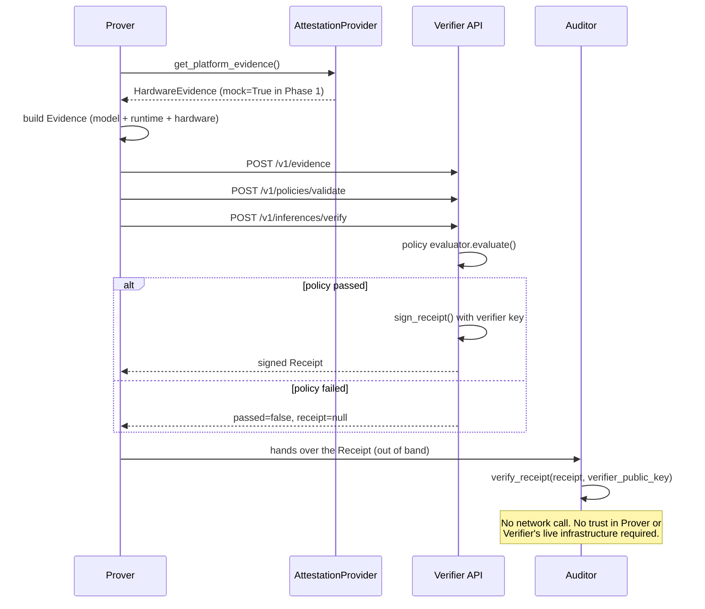

# Architecture

## Scope of this document

This describes the system as it actually exists at the end of Phase 1
(core verification fabric). It does not describe the aspirational full
AI-2040 system. For that gap, see `protocol-roadmap.md` and
`ai2040-coverage-matrix.md`.

## Actors

- **Prover** -- the AI infrastructure operator (a frontier lab, a cloud
  provider, whoever runs the inference). Produces evidence about what it
  ran. In Phase 1, nothing external constrains what the prover reports;
  see `threat-model.md`, question A.
- **Verifier** -- an independent service that evaluates evidence against a
  policy and, if it passes, issues a signed receipt. "Independent" is a
  design goal, not yet an operational fact -- in Phase 1 there is exactly
  one verifier implementation and one demo keypair; see ADR-0001.
- **Auditor / relying party** -- a third party (customer, regulator,
  another lab) that holds a receipt and wants to check it without trusting
  either the prover or the verifier's live infrastructure. This is the
  actor `fv receipt verify` and `VerifierClient.verify_receipt(...,
  verifier_public_key_hex=...)` are built for: both do the check locally,
  offline, from just the receipt and a public key.

## Data flow

## Components and where they live

| Component | Path | Maturity |
|---|---|---|
| Canonical encoding/hashing | `frontier_verify/core/` | EXPERIMENTAL |
| Evidence schema | `frontier_verify/evidence/` | EXPERIMENTAL |
| Attestation interface + mock | `frontier_verify/attestations/` | MOCK (interface: EXPERIMENTAL) |
| Policy model + evaluator | `frontier_verify/policies/` | EXPERIMENTAL |
| Signed receipts | `frontier_verify/receipts/` | EXPERIMENTAL |
| Verifier REST API | `frontier_verify/api/` | EXPERIMENTAL |
| Python SDK | `frontier_verify/sdk/` | EXPERIMENTAL |
| CLI (`fv`) | `cli/fv/` | EXPERIMENTAL |

Everything else the source specification describes -- real NVIDIA
attestation, recomputation, network evidence, Kubernetes, a second
independent-language verifier, vLLM/Triton integrations, a conformance
suite -- is **not in this repository yet**. See `protocol-roadmap.md`.

## Why a single Python package instead of the proposed multi-package monorepo

The source spec's repository layout (section 13) proposes `packages/core`,
`packages/evidence`, `packages/attestations`, etc. as independently
structured packages, plus a separate `sdk/python/`. Phase 1 instead uses
one installable package (`frontier_verify`) with clean internal module
boundaries, and folds the SDK in as `frontier_verify.sdk` re-exported from
the top level -- which is also what the spec's own usage example in
section 16 assumes (`from frontier_verify import VerifierClient`).
Splitting into independently-versioned packages before there's a second
consumer that actually needs independent versioning (e.g. a second-language
verifier that only needs the schema, not the API server) would be
premature structure with no present benefit. See ADR-0002 for the full
reasoning and the condition under which this should be revisited.

## Storage

The Phase 1 API uses `frontier_verify/api/store.py`, an in-memory dict --
explicitly labeled MOCK, not the PostgreSQL + content-addressed object
storage design the source spec calls for in section 53. Restarting the
process loses everything. This is fine for local development and the test
suite; it is not fine for anything else.

## What "independent" actually means in this codebase today

Independence is the central claim of the whole project, so it's worth
being precise about what's actually implemented versus what's still a
name:

- **Achieved**: receipt verification is a pure function
  (`receipts.signing.verify_receipt`) that takes only a public key and the
  receipt bytes. It does not call the API, does not read the in-memory
  store, and does not trust anything the server currently believes. The
  integration test and the live-server demo in the delivery notes both
  exercise this by fetching the key once and then verifying entirely
  offline.
- **Not yet achieved**: there is only one verifier *implementation* and one
  verifier *keypair* in existence. "Independent verifier" in the
  AI-2040/spec sense means a second, differently-built implementation that
  a relying party can run themselves, trusting neither this code nor this
  key. That's Phase 4/9 work (see `protocol-roadmap.md`), not something a
  single reference implementation can claim for itself.
